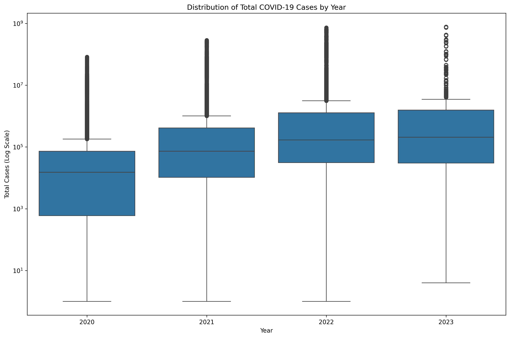

# COVID-19 Data Analysis Project

**A comprehensive COVID-19 data analysis system with automated setup for Lithan Python Module**

---

## 🚀 **QUICK START**

### **Clone & Setup** 

```bash
git clone <repository-url>
cd python-scripts
npm run setup
npm run all
```

**That's it!** The setup script will:
- ✅ Auto-detect your operating system  
- ✅ Check Python installation
- ✅ Create virtual environment
- ✅ Install all dependencies
- ✅ Ready to run activities

---

## 📋 **Requirements**

- **Python 3.8+** ([Download here](https://python.org))
- **Git** (for cloning)
- **npm** (optional - for npm-style commands)

---

## 🎯 **Run Activities**

### **NPM-Style Commands (Recommended)**
```bash
npm run setup          # Initial setup
npm run activity-1     # Data loading & exploration
npm run activity-2     # Data cleaning & features  
npm run activity-3     # Global overview
npm run activity-4     # Regional analysis
npm run activity-5     # Time series analysis
npm run activity-6     # Country comparisons
npm run activity-7     # Additional insights
npm run all           # Run all activities
npm run clean         # Remove generated files
```

### **Python Commands (Alternative)**
```bash
python run.py setup    # Initial setup
python run.py activity1 # Individual activities
python run.py all      # Run all activities
python run.py clean    # Clean outputs
```

### **Manual Setup (Any Platform)**
```bash
# Create virtual environment
python -m venv venv

# Activate virtual environment
source venv/Scripts/activate     # Windows Git Bash
# OR
venv\Scripts\activate.bat        # Windows CMD  
# OR  
source venv/bin/activate         # macOS/Linux

# Install dependencies
pip install -r requirements.txt

# Run analysis
python run.py all
```

---

## 📊 **What You'll Get**

### **Activity Outputs**
```
📁 activity1_images/    ← Data loading & exploration (4 plots)
📁 activity2_images/    ← Data cleaning & features (3 plots)  
📁 activity3_images/    ← Global overview (4 plots)
📁 activity4_images/    ← Regional analysis (4 plots)
📁 activity5_images/    ← Time series analysis (5 plots)
📁 activity6_images/    ← Country comparisons (6 plots)
📁 activity7_images/    ← Additional insights (4 plots)

📄 covid_data_cleaned.csv      ← Cleaned dataset
📄 covid_data_processed.csv    ← Feature-engineered dataset
```

---

## 🔧 **Available Commands**

| Command | Description | Time |
|---------|-------------|------|
| `npm run setup` | Complete environment setup | 2-3 min |
| `npm run all` | Run all 7 activities | 3-5 min |
| `npm run activity-1` | Data loading only | 30-60 sec |
| `npm run activity-2` | Data cleaning only | 30-60 sec |
| `npm run activity-3` | Global analysis only | 30-60 sec |
| `npm run activity-4` | Regional analysis only | 30-60 sec |
| `npm run activity-5` | Time series analysis only | 30-60 sec |
| `npm run activity-6` | Country analysis only | 30-60 sec |
| `npm run activity-7` | Additional insights only | 30-60 sec |
| `npm run clean` | Remove all generated files | 5 sec |

---
## 🖼️ **Full Project Gallery**

<details>
<summary><strong>Activity 1: Data Loading & Exploration</strong></summary>

| Data Exploration Overview | Dataset Timeline |
| :---: | :---: |
|  |  |

</details>

<details>
<summary><strong>Activity 2: Data Cleaning & Feature Engineering</strong></summary>

| Missing Values Before/After | New Features Overview |
| :---: | :---: |
|  |  |

</details>

<details>
<summary><strong>Activity 3: Global COVID-19 Overview</strong></summary>

| WHO Regions Cases/Deaths | Monthly Worldwide Trend |
| :---: | :---: |
|  |  |
| **Correlation Heatmap** | **Cases Evolution in India** |
|  |  |

</details>

<details>
<summary><strong>Activity 4: Regional Analysis</strong></summary>

| New Cases by Region/Month | Total Cases by Year (Box Plot) |
| :---: | :---: |
|  |  |
| **Total Deaths by Region** | **Monthly Analysis** |
|  |  |

</details>

<details>
<summary><strong>Activity 5: Time Series Analysis (Corrected)</strong></summary>

| Daily Trends and Averages | Global Vaccination Trends |
| :---: | :---: |
|  |  |
| **Testing and Positivity Trends** |
|  |

</details>

<details>
<summary><strong>Activity 6: In-Depth Country Analysis (Corrected)</strong></summary>

| Country Evolution (USA) | Cases by Continent (Box Plot) |
| :---: | :---: |
|  |  |
| **Monthly Trend (USA)** |
|  |

</details>

<details>
<summary><strong>Activity 7: Additional Insights</strong></summary>

| Global Fatality Rate | Positivity Rate vs. Tests |
| :---: | :---: |
|  |  |
| **Fatality vs. Smoking** | **Hospital Beds vs. Fatality** |
|  |  |

</details>

---

## 📋 **Project Brief Alignment**

This project implements all requirements from the BDSE PAI Module:

### **Activity 1: Data Loading and Exploration**
- ✅ Load COVID-19 DataFrame  
- ✅ Display first/last 5 rows
- ✅ Check missing values & handle them
- ✅ Remove columns >90% missing
- ✅ Convert date column to datetime

### **Activity 2: Data Cleaning and Feature Engineering**  
- ✅ Impute missing values
- ✅ Remove duplicate rows
- ✅ Create new features (year/month extraction)
- ✅ Explore unique countries

### **Activity 3: Worldwide COVID-19 Overview**
- ✅ WHO Regions with cases/deaths (bar plots)
- ✅ Worldwide monthly trend (line plot)
- ✅ Correlation heatmap (cases vs deaths)
- ✅ Time evolution for specific location

### **Activity 4: Regional Analysis**
- ✅ Grouped bar chart (new cases by continent/month)
- ✅ Distribution by year (box plot)
- ✅ Deaths across continents (bar plot)
- ✅ Month-by-month cases analysis

### **Activity 5: Time Series Analysis**
- ✅ Daily trend of new cases/deaths (line plots)
- ✅ Daily averages globally  
- ✅ Vaccination coverage over time
- ✅ Tests and positive rate analysis

### **Activity 6: In-Depth Country Analysis**
- ✅ Specific country cases/deaths over time
- ✅ User input for country/metric selection
- ✅ Continental distribution (box plot)
- ✅ Year-wise monthly trends by country

### **Activity 7: Additional Insights**  
- ✅ Fatality rate over time globally
- ✅ Positivity rate vs total tests (log scale)
- ✅ Fatality rate relationship with smoking
- ✅ Heatmap: Hospital beds vs fatality rate


---

## 🆘️ **Troubleshooting**

### ⚠️ **"Python not found"**
This error indicates Python is either not installed or not added to your system's environment variables (PATH).

#### ✅ **How to Fix**
- 📅 **[Download Python](https://www.python.org/downloads/)**  
  Choose the latest version compatible with your OS.

- During installation on **Windows**, ensure you enable:  
  ☑️ *"Add Python to PATH"* checkbox.

- For **macOS**, use Homebrew:
  ```bash
  brew install python3
  ```

- For **Linux (Debian/Ubuntu)**:
  ```bash
  sudo apt update
  sudo apt install python3 python3-pip
  ```

🧪 **Verify Installation**:
```bash
python --version
pip --version
```

---

### ⚠️ **"npm not found"**
This error means `npm` (Node Package Manager) is not installed or not available in your terminal.

#### ✅ **Use Python Scripts Instead**
If you're not using Node.js tooling, skip `npm` and run the equivalent Python scripts:
```bash
python run.py setup   # Set up your environment or config
python run.py all     # Run the full analysis pipeline
```

#### 📦 **Need npm? Install Node.js + npm:**
- 📅 **[Download Node.js](https://nodejs.org/)** (includes `npm`)

🧪 **Verify Installation**:
```bash
npm --version
node --version
```

